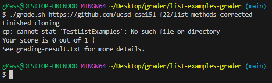
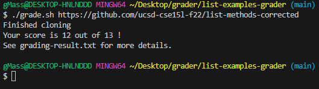

# Part 1

---
# Test Class can't find student submission class methods. What do? 
  **Anonymous**
#### 2:12 AM
Hello! Recently I tried to finish the auto grader for one of the labs. I managed to finish it during the lab session and it worked, but eventually, I forgot to push my changes to Git Hub.
I more or less remember what my files contained and tried to rewrite them to the best of my abilities, but it seems that I'm missing something important because it simply doesn't compile! 
In general, `TestListExamples.java` can't compile when I copy student submissions by `git clone`, but if I manually put `ListExamples.java` into the same directory, it all works well.
Here are some screenshots if it helps.

Thank you very much!

 

---
 **Good TA**
#### 2:20 AM
Hello! Can you please show how you exactly compile those Java files in your `grade.sh` file? As well as directory structure. 

---
  **Anonymous**
#### 2:23 AM
Sure. Here is a brief description of what it is supposed to do. In lines `11-20` we just copy a repository to a new folder for student submissions. Then on lines `21-27`, we check if there is a file in the student submission.
Then we just copy both files to the grading area and compile them.

 
 

---
 **Good TA**
#### 2:26 AM
I'm not sure why exactly you compile files on Line `29`. Try removing it and see what is going to happen.

---
  **Anonymous**
#### 2:30 AM
The idea of that compile is that without it the second compile can't see a `TestListExample.java` at all for some reason, can't say for sure why.

 

---
 **Good TA**
#### 2:34 AM
It seems that the compiler can't find a `TestListExamples` file, are you sure that it's the file you want to compile? Remember that for computers `TestListExamples` and `TestListExamples.java` are different files.
Can you please check what exactly does `$TEST_CLASS` variable contains? 

---
  **Anonymous**
#### 2:37 AM
Oh, I guess that was the problem, thank you very much! Thank you very much!

 

---
  **Anonymous**
#### 2:43 AM
Never mind, now it acts even stranger.

 

---
 **Good TA**
#### 2:50 AM
Please attach the entire code of `grade.sh`, Are there any more symptoms from that command call?

---
  **Anonymous**
#### 2:52 AM
Not a single other clue, here is the entire code of the `grade.sh`

 

---
 **Good TA**
#### 2:58 AM
Oh, I see. So eventually you use your `$TEST_CLASS` variable in 2 lines, the first time when you copy it over to the grading area on Line `31`. But then you also use the same variable when you run the `java` command on Line `46`.
So when bash expands it, we get that Line `46` looks something like this: `java -cp 'classpath stuff' TestListExamples.java`, where we expect to call rather `TestListExamples.class` or just `TestListExamples`.
And the reason why you don't see any other output is that you redirect it to a file `test-result.txt`, so you might as well check it. 
I would recommend returning `$TEST_CLASS` back to what it was before, and then just changing Line `31` so it looks like this: `cp $TEST_CLASS.java grading-area/`.

---
  **Anonymous**
#### 2:67 AM
Thank you very much! Not that it works perfectly! Thank you very much!

 

---
 **Good TA**
#### 3:09 AM
No problem, but Isn't that student submission receive a full score for that particular submission? Can you please send a containment of `grading-result.txt` for details?

---
  **Anonymous**
#### 3:12 AM
Oh, thank you for noticing, I almost forgot about that part. Here is also a screenshot of the method that failed in `TestListExamples.java`.

 
 

---
 **Good TA**
#### 3:20 AM
Try to look closely at Line `117`, and see what exactly your method is comparing. 

---
  **Anonymous**
#### 3:48 AM
Ooooooo, I see. I guess I misspelled it at some point. And was comparing `expected` with `input` instead of `filtered` array. After that fix it seems that everything works even better! 
One more time, thank you very much!

---
 **Good TA**
#### 3:50 AM
Good, good night! 

---
# Part 2

---
It was extremely fun and engaging combining multiple languages in Java and BASH. Unlike common programming in a single language here, you get the experience of how exactly everything is called, how files are connected, and so on.
And the best part of the class will be for sure writing a `auto-grader`. Beyond learning how to connect Java, Git, BASH, and common operations such as creating and removing folders.
We also got experience with doing some neat stuff using BASH. Like getting a score for a test by counting dots `.` and errors `E` for JUnit tests. Using JUnit classes as a grader for assignments. Creating a separate folder and cloning overall to test stuff and so on.
So it was an extremely entertaining and useful class, which I will recommend everyone interested in coding to take. 
